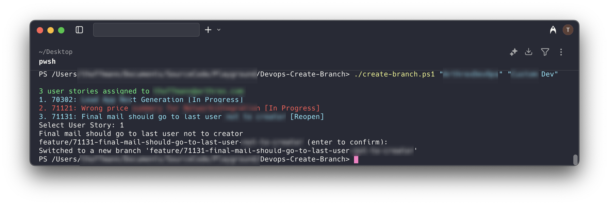

# Devops-Create-Branch

This repository contains a PowerShell script (`create-branch.ps1`) designed to streamline the process of creating and checking out feature or bug branches in a Git repository based on Azure DevOps user stories assigned to you.



## Features

- **Lists user stories assigned to the current user** in Azure DevOps with states that are not closed, done, or otherwise completed.
- **Interactive selection**: Prompts you to select a user story from the list.
- **Automatic branch naming**: Creates a branch name in the format `feature/<id>-<title>` or `bug/<id>-<title>`.
- **Branch management**: Checks if the branch exists; if not, creates it. If it exists, checks it out and stashes/pops any open changes.
- **Configurable behavior**: Option to always create a new branch or just check out if it exists (via `$AlwaysCreateBranch`).
- **Handles Azure CLI and extension setup**: Checks for Azure CLI and Azure DevOps extension, installs if missing.

## Prerequisites

- **Azure CLI** installed and available in your PATH.
- **Git** installed.
- You must be logged in to Azure CLI (`az login`).

## How to Run

1. Open a PowerShell terminal.
2. Run the script with the required parameters:

    ```powershell
    .\create-branch.ps1 -Organization <your-organization> -Project <your-project>
    ```

    - Replace `<your-organization>` with your Azure DevOps organization name.
    - Replace `<your-project>` with your Azure DevOps project name.

3. The script will:
   - Check your Azure CLI login and extension status.
   - List all user stories assigned to you that are in progress.
   - Prompt you to select a user story by number.
   - Suggest a branch name and allow you to confirm or edit it.
   - Create or check out the branch in your local Git repository.

## Example

Parameters with names

```powershell
.\create-branch.ps1 -Organization MyOrganization -Project MyProject
```

Parameters in order

```powershell
.\create-branch.ps1 MyOrganization MyProject
```

No parameters

```powershell
.\create-branch.ps1
```

## Notes

- The script only lists work items assigned to the current Azure AD user and in a non-completed state.
- Branch names are truncated to 100 characters for compatibility.
- If you have uncommitted changes, the script will stash them before switching branches and pop them after checkout.
- You can set `$AlwaysCreateBranch = $true` in the script to always create a new branch, even if it already exists.

## Troubleshooting

- If you see errors about Azure CLI or extensions, ensure both are installed and you are logged in.
- Make sure you run the script from a directory that is a valid Git repository.

## License

See `LICENSE` for details.
